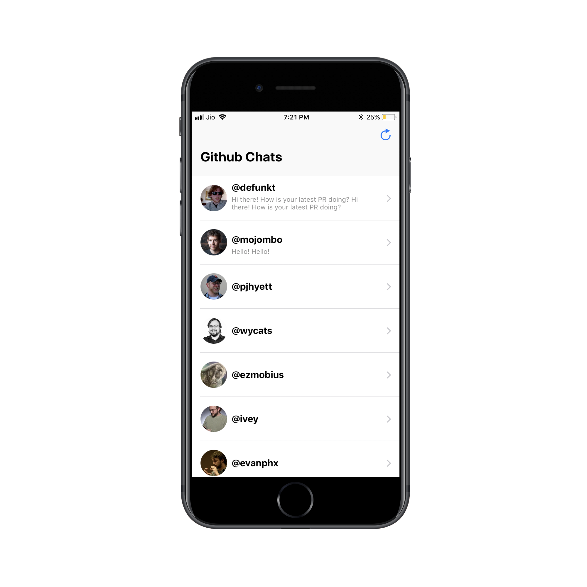
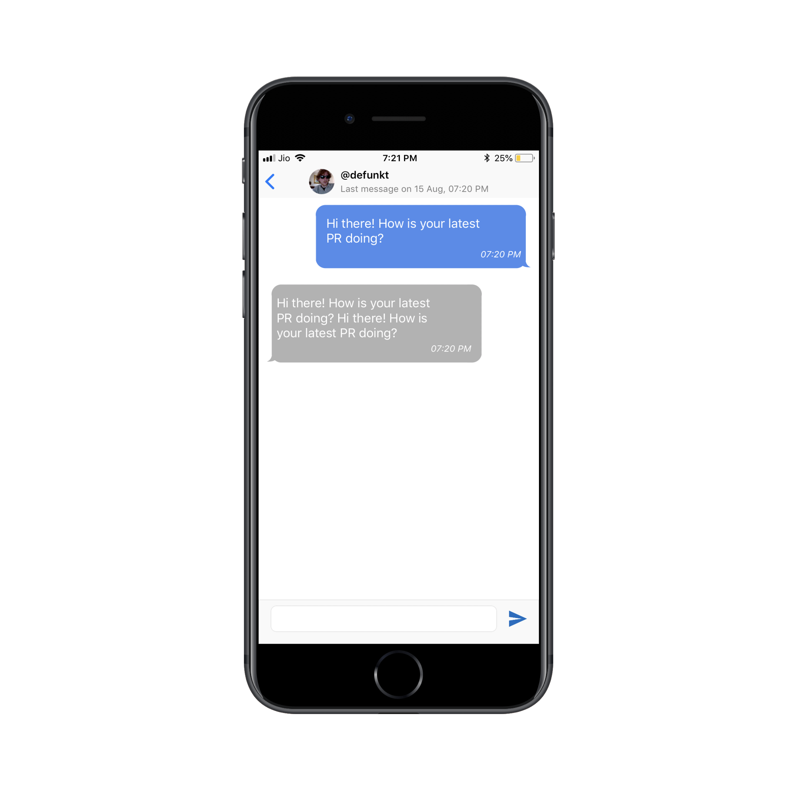
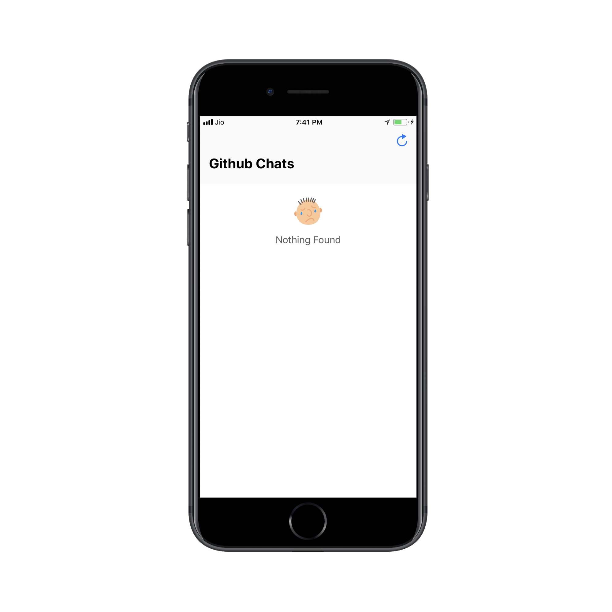

# ChatBot

## Problem Statement

Using one of the two hypothetical scenarios below, please write a simple GitHub Direct Messaging app.
[Complete Document](SKILL_TEST.en.md).

## Solution

#### Screenshots

| User Listing Screen | Chat Screen | No Data | Error  |
|---------------------|-------------|---------|--------|
| |  |  |  |

#### Features
1. Lists GitHub users fetched from network.
2. Pagination for infininte scrolling.
4. Users are sorted by recent chats.
5. Chatting data is saved across application launches.
6. Image caching is implemented for the user profile picture.

## App Architecture
I used VIPER architecture to support main functionalities.

### VIPER
I used VIPER for User Listing and Chat screens. Controllers render ViewModels on the screen. Interactor handles API requests for user listing, while  Presenters manages communication between Controller and Interactor. Router is responsible for the navigation between screens.

### Directory Structure

```
├── MerPayAssignment
│   ├── MerPayAssignment.xcodeproj
│   ├── Chat
│   │   ├── ChatView
│   │   ├── CoreDataModels
│   ├── Generic
│   ├── HeaderView
│   ├── Helper
│   ├── LocalStorage.xcdatamodeld
│   ├── Resources
│   │   ├── Assets.xcassets
│   │   └── LaunchScreen.storyboard
│   └── UserListing
│
└── MerPayAssignmentTests
```

|           Directory               |             Contents            |
|-----------------------------------|---------------------------------|
|`Chat`                             | Chat Screen related files       |
|`Chat/ChatView`                    | Chat View files                 |
|`Chat/CoreDataModels`              | Chat core data files            |
|`Generic`                          | General purpose classes.        |
|`HeaderView`                       | Chat screen header view         |
|`Helper`                           | Base classes                    |
|`LocalStorage.xcdatamodeld`        | Core Data                       |
|`Resources/Assets.xcassets`        | Icons                           |
|`Resources/LaunchScreen.storyboard`| LaunchScreen                    |
|`UserListing`                      | User Listing Views              |
-----------------------------------------------------------------------

## Known Issues
* User profile pictures flicker when scrolled very fast.
* Pagination is not smooth.
